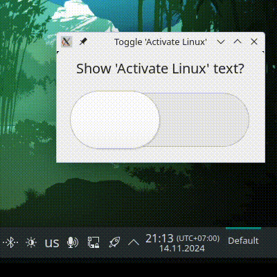

# activate-linux-toggle

Really simple UI application with only a toggle. This setting persist across reboots and re-logins. Setting is user-local.

Here is a quick GIF demo:



## Why was it created

I was disappointed that package `activate-linux` did not provide any easy way to enable this text on boot, so I made it myself.

## CLI usage

This package also provides commands `activate-linux-enable`, `activate-linux-disable`, `activate-linux-is-enabled`. Here is an example usage:

```bash
$ activate-linux-is-enabled
1

$ activate-linux-disable
Removed '/home/ussur/.config/systemd/user/default.target.wants/activate-linux.service'.

$ activate-linux-is-enabled
0

$ activate-linux-enable
Created symlink '/home/ussur/.config/systemd/user/default.target.wants/activate-linux.service' → '/home/ussur/.config/systemd/user/activate-linux.service'.

$ activate-linux-is-enabled
1
```

# Installation

### Via AUR

```bash
$ yay -S activate-linux-toggle
```

Or, if you enabled AUR in pamac:

```
$ sudo pamac install activate-linux-toggle
```

### From GH releases page

Go to latest release and download package manually

### Build arch package yourself

```bash
git clone https://github.com/USSURATONCACHI/activate-linux-toggle
cd activate-linux-toggle
git checkout v1.0.1-aur
makepkg -si
```

# Dependencies

- `activate-linux`
- `gtk4`
- `systemd`
- `coreutils`
- `bash`
